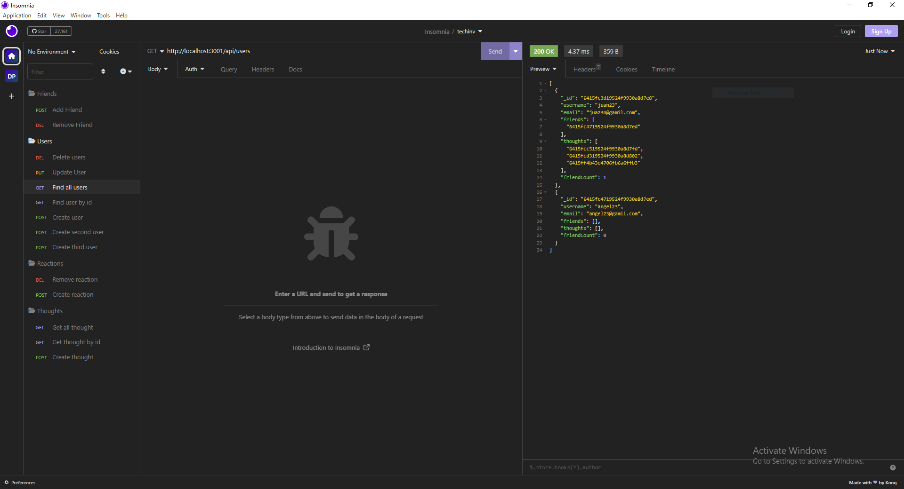

# AppSocial

## Descripcion

Esta sirve como un backend de una redsocial

## Indice

- [Instalacion](#Instalacion)
- [Uso](#Uso)
- [Colaboradores](#Colaboradores)
- [Licencia](#license)
- [Pruebas](#Pruebas)
- [Github](#githubUser)
- [Email](#userEmail)

## Instalacion

Npm i

## Uso

Puedes utilizar esta como el backend de una redsocial

## Demostracion

## Colaboradores

David Morales

## Licencia

    Licencia: MIT

\*[Licencia](#license)

## Pruebas

N/A

## GitHub

[Davidmome](https://github.com/Davidmome/)

## Email

david_morales95@outlook.com
